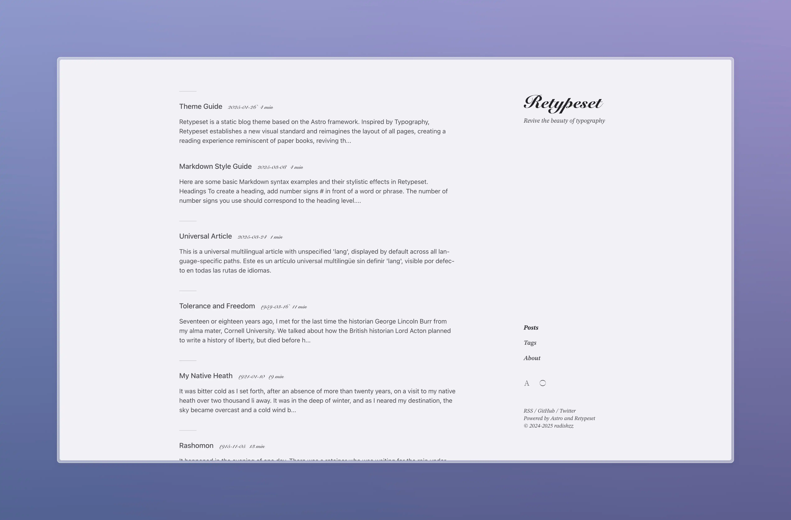
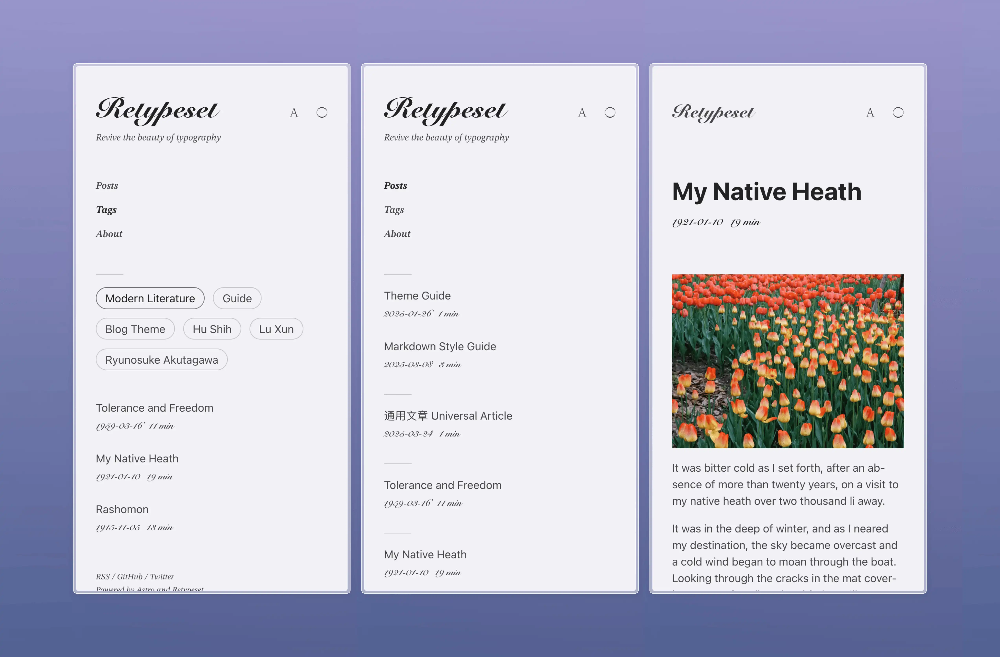

# Code4Focus




[简体中文](assets/docs/README.zh.md)

Code4Focus is the source repository for the Code4Focus writing site. The project runs on [Astro](https://astro.build/) and a customized adaptation of [Retypeset](https://github.com/radishzzz/astro-theme-retypeset), with repository-specific content, workflow, and publishing settings for long-form writing about software, AI, product thinking, and craftsmanship.

## Live Site

- [Primary site](https://code4focus.github.io/)
- [Mirror](https://code4focus.pages.dev/)
- [Standalone pages host](https://mimeadow.pages.dev/)

## Repository Scope

- Bilingual zh/en publishing workflow
- SEO, sitemap, OpenGraph, RSS, MDX, KaTeX, Mermaid, and TOC support
- Typography-first reading experience with responsive layout and theme controls
- Optional comment and analytics integrations
- Deterministic repository verification with `pnpm verify:repo`

## Performance

- [PageSpeed Insights (desktop)](https://pagespeed.web.dev/analysis?url=https%3A%2F%2Fcode4focus.github.io%2F&form_factor=desktop) for the current GitHub Pages homepage.

## Local Development

1. Clone this repository.
2. Install dependencies with `pnpm install`.
3. Start the development server with `pnpm dev`.

```bash
git clone https://github.com/code4focus/code4focus.github.io.git
cd code4focus.github.io
pnpm install
pnpm dev
```

## Environment

- Local development and local builds default the canonical site/feed URL to `http://127.0.0.1:4321`.
- Set `PUBLIC_SITE_URL` in your deployment environment to the primary site origin, for example `https://code4focus.github.io`.
- This repository may also mirror the same build to `https://code4focus.pages.dev`, but GitHub Pages remains the default canonical/feed/site URL unless a separate issue changes the primary domain.
- See [.env.example](.env.example) for the expected variable name.

## Standalone Pages Publishing

- `https://mimeadow.pages.dev/` is a separate Cloudflare Pages Direct Upload project for standalone self-contained HTML experiences.
- Add source files at `standalone-pages-src/<slug>.html`.
- Filenames are the URL contract and must use lowercase letters, numbers, and hyphens only.
- The standalone-pages builder maps each source file to `standalone-pages-dist/<slug>/index.html`, so `standalone-pages-src/lorica.html` publishes to `https://mimeadow.pages.dev/lorica/`.
- The builder also generates `standalone-pages-dist/index.html` as the root index for the standalone host.
- Deployments are handled by `.github/workflows/deploy-mimeadow-pages.yml` and reuse the Cloudflare account secrets already configured for Actions.
- This host does not participate in the blog canonical/feed configuration, does not use Git integration, and in v1 only supports single-file self-contained HTML pages.

## Attribution And License

- Code4Focus is a customized derivative of [Retypeset](https://github.com/radishzzz/astro-theme-retypeset).
- The upstream project is released under the MIT License, and this repository preserves the required copyright and license notice in [LICENSE](LICENSE).
- Attribution is kept intentionally while project-facing copy, links, and operational guidance are maintained for Code4Focus itself.

## Upstream Maintenance

- Maintainers can review selected upstream theme changes with `pnpm update-theme`.
- Upstream syncs should be treated as code import work, not as a reason to restore upstream branding or repository-facing marketing modules.

## Credits

- [Retypeset](https://github.com/radishzzz/astro-theme-retypeset)
- [Typography](https://github.com/moeyua/astro-theme-typography)
- [Fuwari](https://github.com/saicaca/fuwari)
- [Redefine](https://github.com/EvanNotFound/hexo-theme-redefine)
- [AstroPaper](https://github.com/satnaing/astro-paper)
- [heti](https://github.com/sivan/heti)
- [EarlySummerSerif](https://github.com/GuiWonder/EarlySummerSerif)
