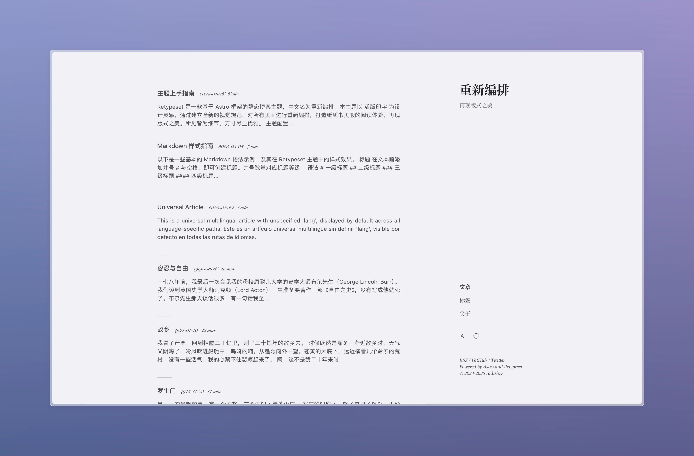
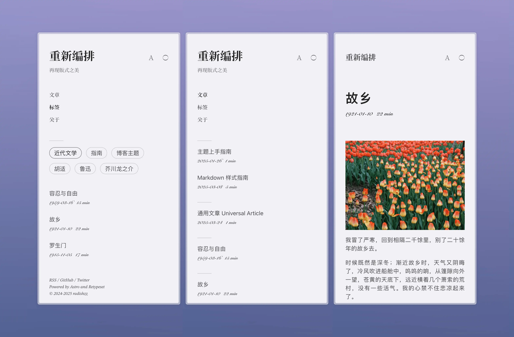

# Code4Focus




Code4Focus 是 Code4Focus 写作站点的源代码仓库。项目运行于 [Astro](https://astro.build/) 之上，并基于 [Retypeset](https://github.com/radishzzz/astro-theme-retypeset) 做了定制化改造，承载本仓库自己的内容、工作流与发布配置，面向软件、AI、产品思考与长期主义创作。

## 站点入口

- [主站](https://code4focus.github.io/)
- [镜像](https://code4focus.pages.dev/)

## 仓库范围

- 中英双语发布工作流
- 支持 SEO、Sitemap、OpenGraph、RSS、MDX、KaTeX、Mermaid 和 TOC
- 以排版阅读体验为中心的响应式布局与主题控制
- 可选的评论与分析集成
- 通过 `pnpm verify:repo` 提供确定性的仓库校验

## 性能

- [PageSpeed Insights（桌面端）](https://pagespeed.web.dev/analysis?url=https%3A%2F%2Fcode4focus.github.io%2F&form_factor=desktop)：当前 GitHub Pages 首页。

## 本地开发

1. 克隆本仓库。
2. 使用 `pnpm install` 安装依赖。
3. 使用 `pnpm dev` 启动开发服务器。

```bash
git clone https://github.com/code4focus/code4focus.github.io.git
cd code4focus.github.io
pnpm install
pnpm dev
```

## 环境说明

- 本地开发与本地构建默认使用 `http://127.0.0.1:4321` 作为规范站点与 feed 地址。
- 在部署环境中通过 `PUBLIC_SITE_URL` 指定主站地址，例如 `https://code4focus.github.io`。
- 本仓库也可以将同一份构建镜像到 `https://code4focus.pages.dev`，但在另有 issue 变更前，GitHub Pages 仍是默认规范地址。
- 变量名请参考 [.env.example](../../.env.example)。

## 归属与许可证

- Code4Focus 是基于 [Retypeset](https://github.com/radishzzz/astro-theme-retypeset) 的定制化衍生项目。
- 上游项目采用 MIT License 发布，本仓库在 [LICENSE](../../LICENSE) 中保留了必须的版权与许可证声明。
- 我们会主动保留必要署名，同时将项目对外文案、链接与运行说明维护为 Code4Focus 自身的表达。

## 上游同步

- 维护者仍可通过 `pnpm update-theme` 审查并引入部分上游主题变更。
- 任何上游同步都应视作代码引入工作，而不是恢复上游品牌文案或仓库门面营销模块的理由。

## 鸣谢

- [Retypeset](https://github.com/radishzzz/astro-theme-retypeset)
- [Typography](https://github.com/moeyua/astro-theme-typography)
- [Fuwari](https://github.com/saicaca/fuwari)
- [Redefine](https://github.com/EvanNotFound/hexo-theme-redefine)
- [AstroPaper](https://github.com/satnaing/astro-paper)
- [赫蹏](https://github.com/sivan/heti)
- [初夏明朝體](https://github.com/GuiWonder/EarlySummerSerif)
